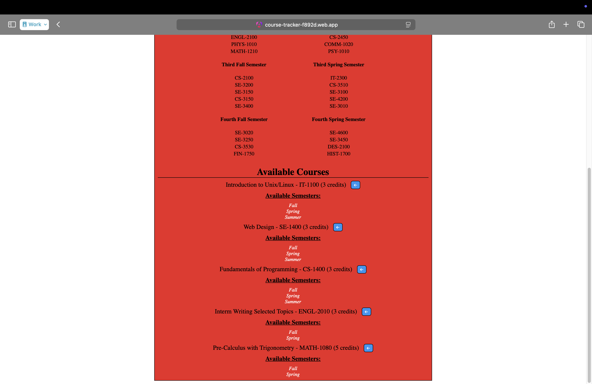

# Course Tracker (Senior Project)

## Description

My senior project is a course tracker/planner meant as a streamlined, easy-to-use version of other methods of course planning like DegreeWorks and Excel spreadsheets.  I am using the Angular framework and TypeScript for the front-end and Google Firebase for the backend and hosting.  

### UI Screenshots

### Figma Mockup
https://www.figma.com/design/LZoU9NSJAXmruuc4uv3OQE/Course-Planner?node-id=0-1&p=f&t=OTUoCZl0vSOBlOsc-0

### Database Design

**User Table:**
- Document ID (String)
- First Name (String) - required for account creation; this is the student's first name
- Last Name (String) - required for account creation; this is the student's last name
- Username (String) - required for account creation; this is the student's username
- Password (String) - required for account creation; this is the student's password
- Major (String) - This is the student's major
- Track (String) - This is the student's major degree track if their chosen major requires a track
- Credits (Number) - optional future feature; This is the number of credits the student has taken and passed
- GPA (Number) - optional future feature; this is the student's GPA based on previous classes and grades
- User Plans (Array of Plans) - This is a list of plan JSON objects

**Degree Table:**
- Document ID (String)
- Degree Title (String)
- Degree Tracks (Array of Strings)
- Passed Courses (Array of Courses)
- Available Courses (Array of Courses)
- Future Courses (Array of Courses)
- Default Plans (Array of Plan)

**Course Table:**
- Document ID (String)
- Course Title (String)
- Course Number (String)
- Prerequisite Courses (Array of Strings)
- Semester Availability (Array of Strings)
- Credit Hours (Number)

**Plan Table:**
- Document ID (String)
- Plan Title (String)
- First Fall Semester (Array of Courses)
- First Spring Semester (Array of Courses)
- Second Fall Semester (Array of Courses)
- Second Spring Semester (Array of Courses)
- Third Fall Semester (Array of Courses)
- Third Spring Semester (Array of Courses)
- Fourth Fall Semester (Array of Courses)
- Fourth Spring Semester (Array of Courses)